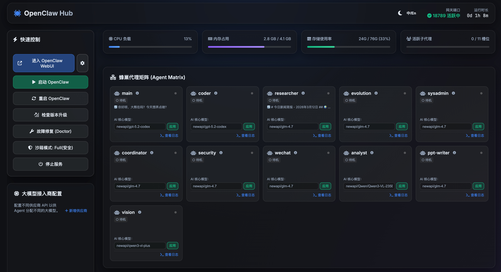
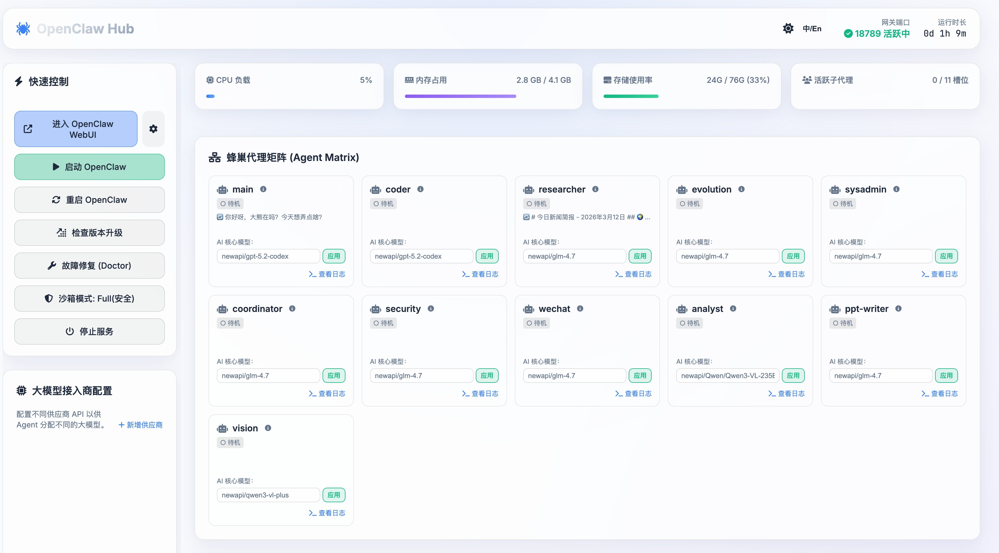

# OpenClaw Dashboard

OpenClaw Dashboard 是一个专为 OpenClaw 开发的基于 Web 的增强型监控与管理看板系统。它弥补了原生命令行在直观可视化及批量配置上的不足，为用户提供一个优雅的玻璃拟态 UI 仪表盘，用于掌控复杂的 LLM 代理矩阵。

## ✨ 核心特性

- 🎛 **系统与进程可视化**：实时展示服务器 CPU、内存、存储与当前活跃代理并发数量。
- 🚥 **代理状态实时追踪**：告别黑盒与假状态。通过穿透解析底层 `.jsonl` 业务流与 `.lock` 文件，准确渲染主代理及 10+ 各类子代理的动作、耗准 Token 数与实时终端日志输出。
- 🧠 **供应商与模型分配管理**：穿梭框交互彻底告别修改复杂的 `openclaw.json`。支持在 Web 端一键添加 Provider、扫描全网模型，并为各个子代理独立分配模型。自带"未找到模型"防坑与硬编码警告。
- 🪟 **玻璃拟态与深度主题**：支持自适应的深/单色毛玻璃主题切换及中英双语 (i18n) 环境适应。
- 🚀 **一键控制台**：免密平滑对接原生 WebUI（携带动态身份令牌）、一键拉取网关重启、快速升降级更新。

## 🛠 架构简介

该 Dashboard 作为一个极轻量级的旁路件运行：
- **后端 (`server.js`)**: 纯净无外部依赖的 Node.js 脚本。监听指定的底层日志，开放 `/api` 数据聚合端口，承揽高负载轮询。
- **前端 (`app.js`, HTML/CSS)**: 不依赖 Vue/React，利用 Vanilla CSS 构筑极致的流式布局系统，提供顺滑交互。

## 🚀 启动与使用

1. 确保您的机器上已有 Node.js 环境（OpenClaw 核心运行必须）。
2. 将本面板作为 OpenClaw 插件全局安装：
   ```bash
   cd ~/.openclaw/dashboard
   npm install -g .
   ```
3. 在终端的**任何目录**下执行启动命令：
   ```bash
   openclaw-dash
   ```
   *Dashboard 会被安全地挂载在后台持续运行，即使关闭终端也不会断开。*

### ⚡️ 面板管理与强制重启
如果您修改了代码需要刷新，请执行：

```bash
# 彻底杀死后台旧进程并按照生产环境重新启动服务
lsof -ti:19010 | xargs -r kill -9 && openclaw-dash
```
*注：`xargs -r` 确保在没找到进程时不报错，且直接使用 `openclaw-dash` 启动更符合您的日常习惯。*

4. 访问面板：
   默认部署在局域网内，打开浏览器访问：
   `http://localhost:19010` 或 `http://<您的IP>:19010`

## 📸 界面预览与说明


*图1：Dashboard 概览，支持实时 Agent 状态矩阵与系统指标监控。*


*图2：多 Agent 日志查看器，现已全面升级为悬浮下拉选择器，节省空间。*

> **📝 进阶（开发者/修改代码后重启）：**
> 如果您拉取了最新的 Dashboard 代码，或者修改了面板源码，只需再此目录下重新执行 `npm install -g .`，然后运行一次 `openclaw-dash`，后台服务即可刷新。

## 📂 目录结构

- `server.js`: Node.js API 中间层服务器（处理跨域、鉴权、日志抓取和代理状态汇集）
- `index.html`: 管理看板的主界面及弹层交互骨架
- `index.css`: 自适应玻璃拟态视觉渲染配置，定义动画及深度颜色变量
- `app.js`: 发动机脚本，承担组件树刷新、网络交互与 DOM 刷新逻辑
